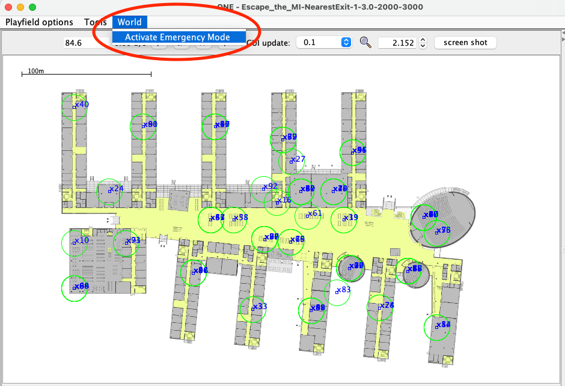

# Assignment 1 - Group 4

## Table of contents
- [Trigger emergency as setting](#trigger-emergency-as-setting)
- [Trigger emergency in the GUI](#trigger-emergency-in-the-gui)
- [Setting files for use-cases](#setting-files-for-use-cases)
  * [Alarming modes](#alarming-modes)
  * [Emergency exit type](#emergency-exit-type)

## Trigger emergency as setting
To schedule an alarm we introduced the following setting:

`Scenario.emergencyRangeTime`

This setting accepts a range (e.g. `2000-3000`). This range indicates the simulation time range in which the emergency
will start. The exact time point in the range is chosen randomly.

This option can be overwritten in the provided setting files or the default value defined in `default_settings.txt` can
be used.

## Trigger emergency in the GUI
We introduced an option to trigger an emergency via the GUI, for this, we added a button in the top.

When activating this option, all hosts enter emergency mode and they start going to an exit.

## Setting files for use-cases
We provide 4 example settings to run our use-case and simulations.
* `assignment_settings/globalAlarming_nearestExit.txt`
* `assignment_settings/globalAlarming_randomExit.txt`
* `assignment_settings/rangeAlarming_nearestExit.txt`
* `assignment_settings/rangeAlarming_randomExit.txt`

### Alarming modes
* `globalAlarming` instantly sets all hosts to emergency state once the emergency start time is reached.
* `rangeAlarming` activates emergency state on the hosts based on emergency message routing.

### Emergency exit type
* `nearestExit` Once a host is in emergency state, it will go to the **nearest** exit to escape the FMI building.
* `randomExit` Once a host is in emergency state, it will go to a **random** exit to escape the FMI building.
